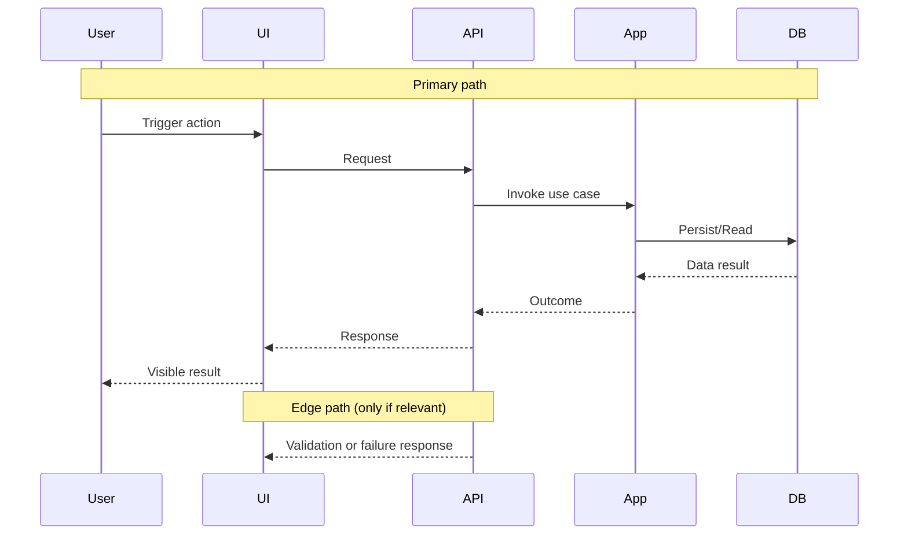

# Barn Log Code Review

## Review Workflow

1. Load repo instructions:
- Read the root `AGENTS.md` and any nearest applicable nested `AGENTS.md` files for changed paths.
- For frontend Svelte changes (`frontend/**/*.svelte`, `frontend/**/*.svelte.ts`, `frontend/**/*.svelte.js`), load and apply `svelte-core-bestpractices`.
- For frontend UI review scope, load and apply `critique`, `audit`, and `web-design-guidelines` in addition to code-level review.

2. Identify review target and changed files:
- Use `git status --short` for working-tree review.
- Default review base to `master` and use `git diff --name-only master...HEAD`.
- If the user explicitly provides a different base branch/commit, use that instead.
- If the user explicitly names a branch/PR, diff that target (`master...<branch-or-pr-head>`) instead of assuming the current working tree.

3. Review diffs for behavior and risk:
- Look for runtime errors, logic flaws, and behavioral regressions.
- Check migration safety (forward + rollback feasibility) when SQL changes.
- Check API/DTO compatibility where contracts changed.
- Confirm tests cover new behavior and failure paths.
- For frontend UI changes, also check:
- UX hierarchy and information clarity regressions
- Accessibility gaps (keyboard/focus/contrast/semantics)
- Responsive breakpoints and layout stability
- Copy/microcopy clarity and error-state quality
- Regressions against shared design patterns and tokens

4. Produce the required output format below.

## Required Output Format

1. Findings (ordered by severity: high, medium, low):
- Severity
- File reference
- Issue
- Why it matters
- Suggested fix

2. Walkthrough:
- 3-6 sentences describing the overall change intent and behavior impact.

3. Changes table:
- Use a compact table with `Cohort / File(s) / Summary`.
- Group related files into cohorts (for example: UI flow, API surface, persistence, tooling).

4. Open questions/assumptions:
- Include only unresolved items that affect confidence.

5. Overall change map (Mermaid sequence diagram):
- Diagram the entire changeset, not an individual patch hunk or single comment.
- Use Mermaid `sequenceDiagram` as the default format.
- If the changeset has no runtime interaction changes (for example docs/config/tooling-only updates), use this exact fallback line instead of a diagram:
- `No runtime interaction changes in scope`
- Include all applicable runtime changes from the review scope.
- Keep it readable:
- Max 6 participants.
- Max 12 arrows/interactions.
- Participant names must be role-level (for example `UI`, `API`, `App`, `DB`) and not raw file paths.
- Sequence participants must be runtime actors/components only.
- Do not include CI/build/test/lint actors (for example `Build`, `Tests`, `CI`, `Linter`) in this diagram.
- Include the primary end-to-end path and one failure/edge path only when relevant to findings.
- Tie each high/medium finding to at least one node/entity name in the diagram.
- Add a short `Legend:` line under the diagram mapping each participant to main files changed.
- If any applicable runtime change is omitted for readability, add one line under the diagram:
- `Omitted from diagram: <item> - <reason>`
- Add a text fallback directly below the Mermaid block as `Map (text): A -> B (relationship)` lines for clients that do not render Mermaid.

6. Non-runtime risk trace (only when relevant):
- Use concise lines for dependency/tooling/test risks as `Cause -> Immediate impact -> Developer/User impact`.
- Keep this separate from the runtime sequence diagram.

7. Test evidence (only if explicitly requested):
- Commands executed
- Pass/fail result
- Gaps not verified

8. Optional patch suggestions:
- Include only minimal, high-value diffs.

## Mermaid Template (Sequence)

## Guardrails

- Prioritize correctness and regression risk over style-only feedback.
- Include UX/accessibility/design findings when frontend UI files are in scope.
- Cite concrete evidence from the diff; do not speculate without support.
- Treat workflow steps as guidance, not a whitelist; review all changed files.
- Do not run CI-style verification commands unless the user explicitly asks for local verification.
- Keep diagrams behavior-centric; place build/dependency/test risks in `Non-runtime risk trace`.
- Do not silently omit applicable runtime changes from the diagram.
- If no findings are discovered, state that explicitly and call out residual risk from untested paths.
